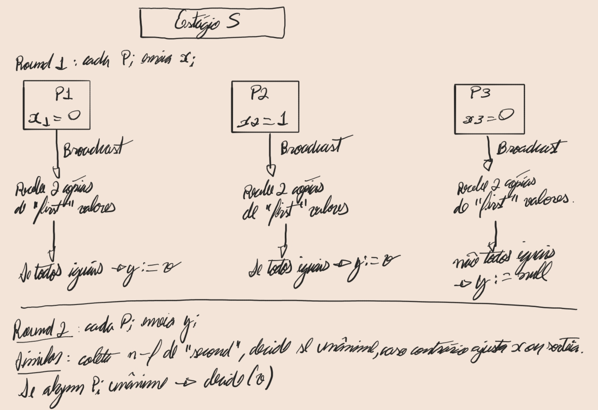

# Ben-or
### Contexto e Impossibilidade

- Em **sistemas assíncronos** sem relógio global, *Agreement* não é solucionável se até 1 crash pode ocorrer (FLP, 1985).
- Para contornar, **randomizamos**: aceitamos terminação apenas "com probabilidade 1" (quase-certa).

---

### Modelo e Problema Fraco

- Há *n* processos, até *f* crashes, canais confiáveis, assíncronos.
- Cada processo recebe *init(v)*, depois deve emitir *decide(v)*.
- Queremos *Agreement*, *Validity*, e *Termination*:
  – Prob("todos decidem em tempo finito") = 1.

---

### Esquema do Ben-Or

Cada processo *Pi* mantém

- `x ∈ {0,1}`: seu palpite atual
- `y ∈ {0,1,null}`: apoio nesta rodada
- `f`: é o número máximo de falhas do tipo crash que o protocolo consegue tolerar
- `N`: é o número total de nós (processos)
- `p`: probabilidade de sair 1

E executa estágios *s = 1,2,3...*; cada estágio tem **2 rounds**:

### Propriedades e Terminação

- **Agreement e Validity:** determinísticos, seguem de quóruns *n − f* e *n − 2f*.
- **Termination quase-certa:** a cada estágio, há probabilidade maior ou igual de que *p > 0* de ser unânime -> decide;
  repete-se até sucesso, logo termina com prob. 1.
- **Requisito:** *n > 3f*.

Ben-Or mostra: com **randomização** e quóruns ligeiramente menores, ultrapassa a barreira FLP.

