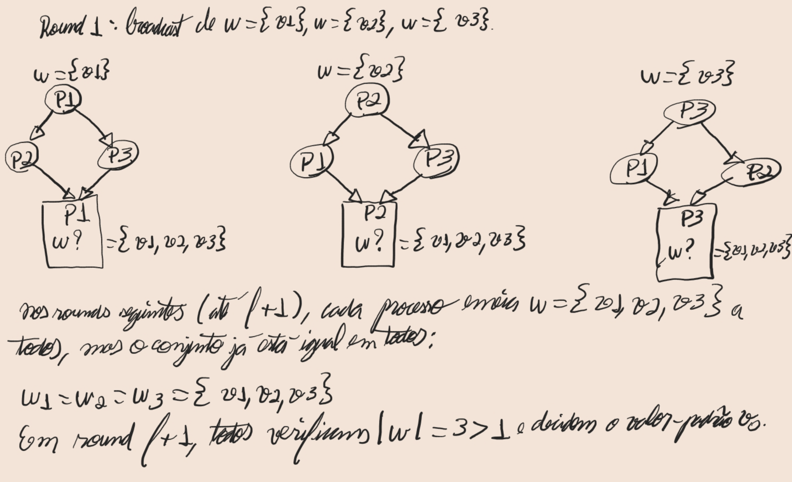

# - **Capítulo 6 - Distributed Consensus with Process Failures - (Síncrono):**
## FloodSet - algoritmo determinístico em *f+1* rounds que tolera até *f* crashes.

### Introdução e contexto

Apresenta-se o problema de consenso em sistemas síncronos com falhas de parada.
Especifica-se um modelo com n processos interconectados por canais perfeitamente confiáveis e síncronos,
em que, a cada round, cada processo envia suas mensagens, recebe as mensagens deste round
e executa atualização local do estado.
Define-se que até f crashes podem ocorrer (ou seja, processos podem parar sem aviso)
e que o FloodSet tolera até f falhas, garantindo decisão única a partir de um conjunto de valores V.

### Definição do problema de Agreement

Formaliza-se o problema de Agreement: cada processo *i* inicia com valor *vₖ ∈ V*.
Impõem-se três condições:

1. **Termination:** todos os processos não-falhos devem decidir em tempo finito.
2. **Agreement:** não é permitido que dois processos não-falhos decidam valores distintos.
3. **Validity:** se todos os processos não-falhos começam com o mesmo valor *v*, então *v* é a única decisão possível.

---

### Descrição detalhada do FloodSet

Descreve-se o FloodSet, que opera em exatamente *f + 1* rounds.
Cada processo mantém um conjunto *W*, inicializado em *{vᵢ}*. A cada round:

1. **Broadcast:** envia-se *W* a todos os demais processos.
2. **Recepção:** recebem-se os conjuntos *Wⱼ* enviados.
3. **Atualização:** realiza-se

Ao término de *f + 1* rounds, cada processo inspeciona *W*: se *|W| = 1*, decide-se o único elemento;
caso contrário, decide-se um valor-padrão *v₀*.  
A justificativa é que, com até *f* crashes, há pelo menos um round íntegro; nesse round, todos os *W* se igualam, garantindo convergência.

---

### Esboço de correção e intuição

Apresentam-se três lemas fundamentais:

- **Lema 1:** em qualquer round sem falha, todos os processos ativos têm o mesmo *W* ao final.
- **Lema 2:** uma vez iguais em round *r*, mantém-se essa igualdade até round *f + 1*.
- **Lema 3:** sendo no máximo *f* crashes, existe round íntegro entre 1 e *f + 1*, de onde resulta que todos os *W* convergem em *f + 1*.

Dessa forma, quaisquer dois processos não-falhos decidem o mesmo valor (Agreement).
A Validity decorre do fato de que, se todos iniciam com *v*, nenhum outro valor jamais entra em *W*.

### Complexidade e considerações finais

Resume-se a complexidade:

- **Rounds:** *f + 1*
- **Mensagens:** até *O((f + 1) · n²)*
- **Bits:** *O((f + 1) · n³ · b)*, com *b* = bits necessários por valor

Observa-se que, embora o FloodSet seja simples e determinístico, sua comunicação cresce cubicamente em *n*.
Para aplicações práticas, mencionam-se variantes como **OptFloodSet** (até dois broadcasts por processo)
e algoritmos baseados em **EIG**, que mantêm a mesma estratégia de propagar e agregar informações
em múltiplos rounds para tolerar crashes.

